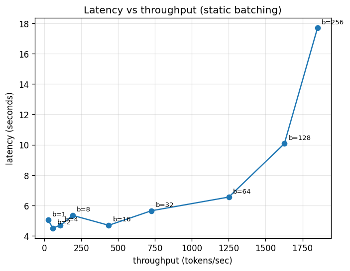
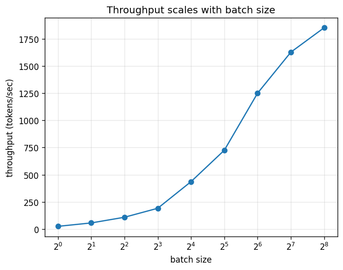

# LLM Inference Engine: Static & Continuous Batching
The goal of this project is to show how batching makes LLM's faster. model.generate runs a loop that picks tokens. This is a high level method that doesn't offer control. So I broke it down with greedy decoding by hand. Then a built two batching strategies: static batching and continuous batching with iteration-level scheduling, which is very similar to a project i did in Algo (capcity based scheduling). So if you are familiar with capacity based scheduling, then continuous batching should be relatively easy to learn.

**Highlights**
- **Static batching** scales throughput ~73× (25 → 1,850 tok/s) as batch size grows, up to the point the GPU saturates.
- **Continuous batching** a scheduler that keeps the GPU full by putting queued requests into slots the instant finished ones leave. 

## The Files

 
- **`model.py` — `ModelRunner.generate_single`**: This is the handwritten greedy decoding algorithm i was talking about. It's one token per step.
- **`engine.py` — `static_batch`**: this stacks prompts into a left-padded batch and runs them start-to-finish together.
- **`engine.py` — `dynamic_batch`**: adds mid-generation **eviction** — As soon as prompt has a stop token, it is removed from the batch. Basically step 1 of continuous batching.
- **`engine.py` — `continuous_batch`**: adds **admission** — Same process as the dynamic batch, but once a sequence leaves, a waiting one takes its place.


## Continuous batching in action
 
With `max_batch=3` and 8 queued requests, slots refill mid-generation as sequences finish:
 
```
admit seq 0, 1, 2         batch = 3, queue = 5
step 8:   seq 0 done  ->  admit seq 3
step 12:  seq 1 done  ->  admit seq 4
step 17:  seq 3 done  ->  admit seq 5
step 31:  seq 5 done  ->  admit seq 6
step 141: seq 4 done  ->  admit seq 7   (queue empty)
step 200 / 221 / 231: the long-running sequences drain out
```
The batch stays full the whole time that there is work waiting. This makes sure the GPU is always working. Sorry GPU.
Note: admitssion rebulilds the batch's cache with a fresh prefill instead of splicing in the new requeest's cache. This is a simplification.
## Benchmark results (static batching)
 
Throughput and latency across a batch-size sweep:
 

 

 
| batch size | throughput (tok/s) | latency (s) |
|-----------:|-------------------:|------------:|
| 1          | 25.4               | 5.04        |
| 2          | 56.8               | 4.51        |
| 4          | 109.1              | 4.69        |
| 8          | 191.6              | 5.35        |
| 16         | 436.5              | 4.69        |
| 32         | 725.1              | 5.65        |
| 64         | 1250.3             | 6.55        |
| 128        | 1627.1             | 10.07       |
| 256        | 1851.9             | 17.70       |
 
*Qwen2.5-1.5B, fp16, greedy decode, fixed 128 output tokens per request, single Colab T4 (16 GB).*
 
 ## Running it
 
```bash
git clone https://github.com/nick11255/LLM-Benchmarks.git
cd LLM-Benchmarks
pip install transformers accelerate      # torch comes preinstalled on Colab
python bench.py    # static-batch sweep, writes results.csv
python plot.py     # writes pareto.png and throughput.png
```
 
Continuous batching (queue of prompts, `max_batch` slots):
 
```python
from model import ModelRunner
from engine import continuous_batch
 
runner = ModelRunner()
outs = continuous_batch(prompts, runner.model, runner.tok, max_batch=3)
```
Because I don't have an NVIDIA GPU, I ran this on a free Colab T4. 